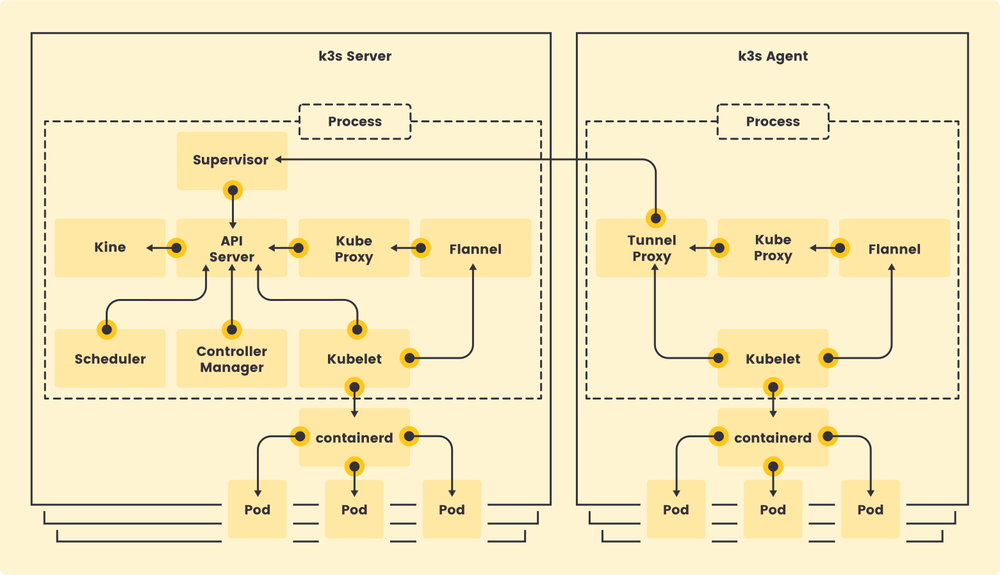
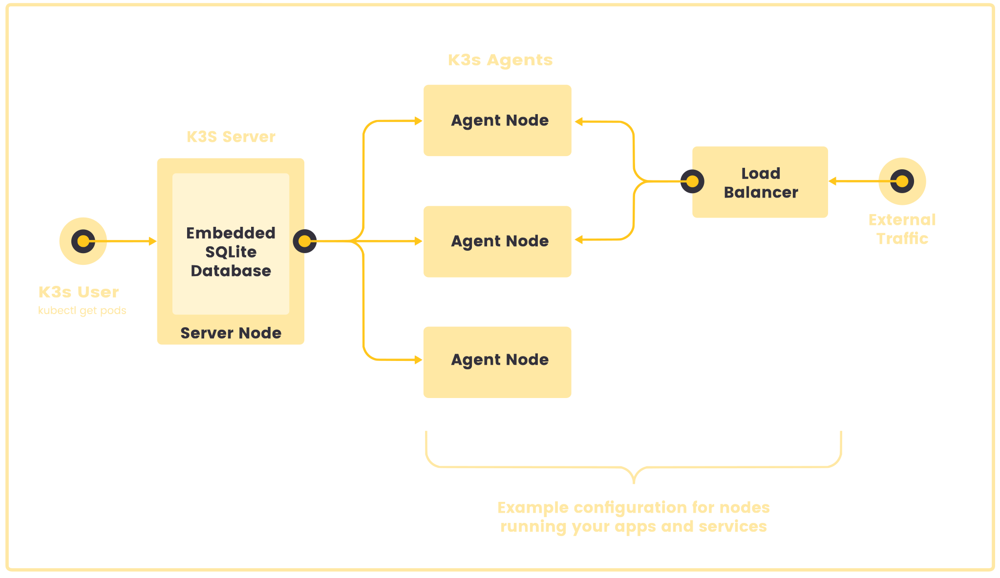
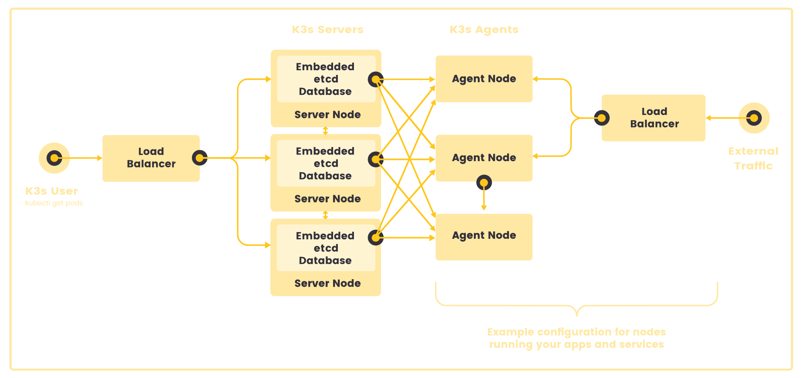
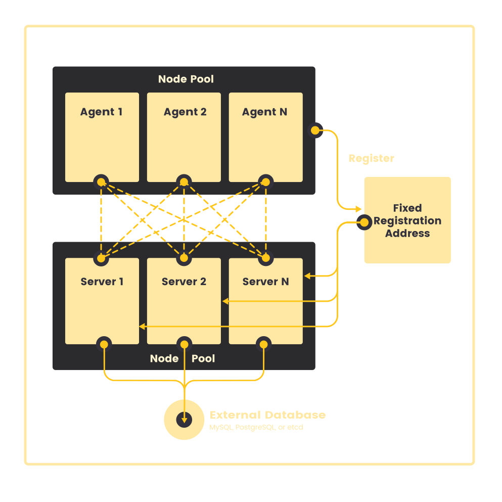

# KUBERNETES
Orchestratore di container, design: accoppiamento debole tra container, indipendente dall'infrastruttura.
> Può fare:
> - Storage discovery e load balancing
> - Autoscaling, rollback e rollout automatici
> - Orchestrazione
> Non può fare
> - Fornire architettura a livello applicazione
> - Deployare / Buildare un'applicazione
 

- Repository: https://github.com/kubernetes/kubernetes
- Componenti: https://kubernetes.io/docs/concepts/overview/components/

Struttura principale: [ Cluster [ Node [ Pod ] ] ]

# K3S (versione consigliata dal professore per IoT)
Versione leggera di kubernetes con poco overhead.
- Distribuzione compatta: fornita come un singolo file binario o un'immagine container minimale.
- Archiviazione integrata: utilizza SQLite3 come backend predefinito, con supporto per etcd3, MySQL e PostgreSQL.
- Facilità di gestione: include un launcher che semplifica la configurazione di TLS e opzioni.
- Sicurezza predefinita: impostazioni sicure per ambienti leggeri.
- Gestione semplificata: l'intero piano di controllo di Kubernetes è eseguito in un unico processo, automatizzando operazioni complesse.
- Minime dipendenze esterne: richiede solo un kernel moderno e i cgroup montati.
- Componenti inclusi per una configurazione pronta all'uso:
	- containerd / cri-dockerd (runtime container)
    - Flannel (rete CNI)
    - CoreDNS (DNS del cluster)
    - Traefik (Ingress Controller)
    - ServiceLB (bilanciamento del carico)
    - Kube-router (policy di rete)
    - Local-path-provisioner (gestione storage locale)
    - Spegel (mirror distribuito per immagini container)
    - Strumenti di sistema (iptables, socat, ecc.)

# Architettura di K3S:
## Server e agent
- ``` k3s server```: equivalente al Control Plane di Kubernetes, è il nodo che gestisce il cluster. Di solito assegna i pod ai nodi

  - API Server → riceve le richieste da kubectl e dal controller.

  - Controller Manager → mantiene lo stato desiderato del cluster.

  - Scheduler → assegna i Pod ai nodi disponibili.

  - Embedded SQLite (o altro DB) → K3s usa SQLite invece di etcd per la persistenza dei dati, riducendo il consumo di risorse.

- ``` k3s agent```: è un host che esegue senza controlpane e datastore, si connette al server per ricevere istruzioni.

In entrambi:
- c'è un kublet che comunica con i il containerd
- containerd utilizzato al _posto di docker_ per gestire dei Pod[1 ... N]
 


**fasi di registrazione dei nodi agent**:
1. **Connessione al server node:**
	
	L'agente si connette al supervisore (e al kube-apiserver) attraverso un bilanciatore locale sulla porta 6443.
	Il bilanciatore mantiene una lista di endpoint disponibili, inizialmente contenente solo l'indirizzo specificato con --server.
2. **Recupero degli endpoint del cluster**:

    Dopo la connessione iniziale, l'agente ottiene l'elenco degli indirizzi dei kube-apiserver dal servizio Kubernetes nel namespace predefinito.

    Questi endpoint vengono aggiunti al bilanciatore, le connessioni sono tolleranti a guasti di singoli server.

3. **Autenticazione del nodo:**

    L'agente si registra al server usando un segreto del cluster e una password generata casualmente, salvata in ```/etc/rancher/node/password```.

    Il server memorizza queste password come segreti Kubernetes nel namespace kube-system, con il formato ```<hostname>.node-password.k3s```.

4. **Rimozione e riaggiunta di un nodo:**

    Se la directory ```/etc/rancher/node``` viene eliminata o se un nodo deve essere reintegrato con lo stesso nome, prima deve essere rimosso dal cluster.

    La rimozione pulisce l'entry del nodo e il relativo segreto, permettendo la sua nuova registrazione.

5. **Riutilizzo di nomi host:**

    Se si riutilizzano frequentemente gli stessi nomi host ma non è possibile eliminare i segreti delle password dei nodi, si può usare il flag ```--with-node-id```.

    Questo flag aggiunge automaticamente un ID univoco al nome host, memorizzandolo in ```/etc/rancher/node/```.

## Sestup single-server con DB

Ogni agent node è registrato sullo stesso server node. Un utente puà effettuare chiamate
API sul server node per gestire le risorse



## High-Availability K3s

Architettura simile, ma tra l'user e il server c'è un **Load Balancer**.
- I server node ( 3 o più) servono le API kubernetes ed eseguono altri servizi come il control-plane.
- Un datastore interno come etcd o esterno comes postgre, SQLite è usato per la persistenza dei dati.


## Fixed Registration Adress per agent nodes

Dopo la registrazione con il nodo agent, stabilisce una connessione direttamente con uno dei server node.



# Installazione locale e su più nodi di k3s
## Requisiti
- Server: 2 core CPU, 2 GB RAM (con 4GB di ram supporta fino a 350 agent, nodi server (HA) aumentano la capacità del 50%)
- Agent: 1 core CPU, 512 MB RAM
- Disco: Preferibile SSD per prestazioni ottimali (evitare SD card o eMMC su Raspberry Pi)

Architettura e OS Supportati
 -Supporta x86_64, ARMHF, ARM64/AARCH64
- Funziona su Linux, con alcuni setup aggiuntivi per SUSE, RHEL, Fedora, Ubuntu, Debian e Raspberry Pi OS

**Configurazione**
- Hostname univoco per ogni nodo (usare ```--with-node-id``` se riutilizzati)
- Cgroups attivi su Raspberry Pi (aggiungere ```cgroup_memory=1 cgroup_enable=memory``` a ```/boot/cmdline.txt```)
- Su Ubuntu (21.10-23.10), installare ```linux-modules-extra-raspi``` per supporto VXLAN

**Networking**

- Porta ```6443```: accessibile da tutti i nodi per API Kubernetes
- Porta ```8472``` (UDP): richiesta per Flannel VXLAN
- Porta ```10250``` (TCP): necessaria per il metrics server
- Porta ```2379-2380``` (TCP): richiesta solo per HA con embedded etcd
- Proteggere la porta ```VXLAN``` (8472) con un firewall per evitare attacchi alla rete del cluster

> Nota: Per cluster grandi, aumentare la subnet del Cluster CIDR (```--cluster-cidr```) per non esaurire IP.


## API
**Cluster signolo nodo**
```sh

curl -sfL https://get.k3s.io | sh - # installa in locale
# INSTALL_K3S_EXEC="server --flannel-backend none" K3S_TOKEN=12345 sh -s - # con variabili d'ambiente

# Per creare un cluster multi-nodo, i nodi devono connettersi al master.

sudo cat /var/lib/rancher/k3s/server/node-token       # visualizza il token
curl -sfL https://get.k3s.io | K3S_URL="https://[MASTER_IP]:6443" K3S_TOKEN="<TOKEN>" sh -

kubectl get nodes                   # visualizza nodi attivi
```

Disposizione di server e agent: 
```sh
sudo k3s server
sudo k3s kubectl get nodes

# On a different node run the below. NODE_TOKEN comes from
sudo k3s agent --server https://myserver:6443 --token ${NODE_TOKEN}
## API k3s
L'API sever espone una REST API

Il "desired state" è espresso tramite un file YAML

Il CLI () di kubernetes è chiamato kubectl comunica con l'API server e le sue informazioni di connessione
sono nella cartella ```~/.kube/config``` 

Il "contesto" è un grupo di parametri di accesso a un cluster k3s. 
Contiene un cluster k3s, utente e un namespace.


```

## Fasi di Configurazione k3s

### 1. Deployment
Un Deployment è una risorsa che gestisce il lifecycle di uno o più Pod in Kubernetes. Permette di:
- Creare e aggiornare gruppi di Pod.
- Gestire il numero di repliche (scalabilità).
- Assicurare che l’applicazione sia sempre disponibile.
- Fare rollback a una versione precedente se necessario.

Tutti i deployment sono visualizzabili con ```kubectl get deployments```, indicando anche i pod attivi

#### Esempio
```yaml
apiVersion: apps/v1
kind: Deployment
metadata:
  name: [nome-app]
  labels:
    app: [nome-app]
spec:
  replicas: [n-pods]  # 🔹 Numero di repliche dei Pod
  selector:
    matchLabels:
      app: [nome-app]  # 🔹 Kubernetes sa che questi Pod appartengono a questo Deployment
  template:
    metadata:
      labels:
        app: [nome-app]  # 🔹 Etichetta assegnata ai Pod per il Service
    spec:
      containers:
      - name: [nome-app]
        image: [nome-immagine]:[versione]  # 🔹 L'immagine da usare
        ports:
        - containerPort: [porta]  # 🔹 La porta che il container espone

```
- Se un Pod si arresta per errore, Kubernetes lo ricrea automaticamente.
- Il Deployment si assicura che ci siano sempre N Pod attivi.

> ***IMPORTANTE***
> Dato che k3s usa containerd invece di Docker, devi caricare l'immagine nel registry interno.

### 2. Service
#### Tipi di Servizi in Kubernetes

In Kubernetes, un **Service** è un'astrazione che espone un'applicazione in esecuzione su un insieme di **Pod**, fornendo un punto di accesso stabile.  
Esistono diversi tipi di Service, ognuno con un uso specifico.

---

1. **ClusterIP (Default)**
- **Cos'è?**  
Rende il servizio accessibile **solo all'interno del cluster**, assegnando un IP virtuale interno.  

- **Quando usarlo?**  
Quando un'app deve essere accessibile solo da altri pod nel cluster (es. microservizi interni).

```yaml
apiVersion: v1
kind: Service
metadata:
  name: my-service
spec:
  selector:
    app: my-app
  ports:
    - protocol: TCP
      port: 80
      targetPort: 8080
```

2. **NodePort**
- **Cos'è?**  
Espone il servizio su una porta fissa di ogni nodo, rendendolo accessibile dall'esterno tramite [NodeIP]:[NodePort]. 

- **Quando usarlo?**  
Testare un accesso esterno senza un bilanciatore di carico.

```yaml
apiVersion: v1
kind: Service
metadata:
  name: my-service
spec:
  type: NodePort
  selector:
    app: my-app
  ports:
    - protocol: TCP
      port: 80
      targetPort: 8080
      nodePort: 30007  # Deve essere tra 30000 e 32767
```

- Per poter esporre un pod all'esterno devo creare un service. I Pod, infatti, hanno un IP volatile, quindi se uno viene riavviato cambia IP e l’applicazione potrebbe non trovarlo più.

3. **LoadBalancer**
- **Cos'è?**  
Crea un IP pubblico e un bilanciatore di carico esterno per instradare il traffico ai pod interni. (Richiede un provider cloud o MetalLB per ambienti on-prem).
- **Quando usarlo?**  
Se vuoi esporre un servizio su internet con un IP pubblico e bilanciamento del carico.

```yaml
apiVersion: v1
kind: Service
metadata:
  name: my-service
spec:
  type: LoadBalancer
  selector:
    app: my-app
  ports:
    - protocol: TCP
      port: 80
      targetPort: 8080
```

4. **ExternalName - 5. HeadlessService**
Il 4. reindirizza il traffico a un nome di dominio esterno, il 5. Non assegna un IP al servizio, ma restituisce direttamente gli indirizzi IP dei pod.

- Per poter esporre un pod all'esterno devo creare un service. I Pod, infatti, hanno un IP volatile, quindi se uno viene riavviato cambia IP e l’applicazione potrebbe non trovarlo più.

#### Esempio con NodePort
Rendo il servizio disponibile nella mia sottorete
```yaml
apiVersion: v1
kind: Service
metadata:
  name: [nome-servizio]
spec:
  selector:
    app: [nome-servizio]
  ports:
    - protocol: TCP
      port: [port]
      targetPort: [port]
      nodePort: 30007  # 🔹 Kubernetes assegna una porta tra 30000-32767
  type: NodePort

```
Per visualizzare il servizio tra altre macchine, eseguo ```ip a``` e noto che il mio Ip Pubblico è ```inet 192.168.178.42/24 brd 192.168.178.255 scope global dynamic noprefixroute wlo1```.
Perciò alla porta 30080 di quell'indirizzo trovo la pagina che ho hostato. Vale però solo per la mia **Sottorete**.

### 3. Ingress
Se hai più servizi e vuoi gestirli con un unico punto di accesso, usi un Ingress. Serve un Ingress Controller gestire il routing del traffico HTTP/HTTPS in modo più sofisticato.
Nel caso di un Ingress, generalmente il Service sarà di tipo ClusterIP (accessibile solo dentro il cluster) e si occupa di indirizzare il traffico ai pod corretti in base al nome e alla porta.
- Definzione regole: Definisci regole che stabiliscono quali percorsi (URL) devono essere indirizzati a quale Service.
- Indirizzamento tramite hostname: puoi definire il dominio (ad esempio, myapp.local) e quali percorsi (es. /api, /docs) devono essere inviati a ciascun servizio.
- Configurazione dell'Ingress Controller

```yaml
apiVersion: networking.k8s.io/v1
kind: Ingress
metadata:
  name: my-app-ingress
spec:
  rules:
  - host: myapp.local  # dominio per accedere all'app, verrà reindirizzato a
    http:
      paths:
      - path: /        # Il traffico che arriva su root viene inviato al service
        pathType: Prefix
        backend:
          service:
            name: my-app-service  # Il nome del service che riceve il traffico
            port:
              number: 80  # La porta esposta dal service
```
Va poi verificata la configurazione del DNS per accedere tramite il dominio desiderato.
Per accedere all' Ingress con un dominio personalizzato va Modificato il file /etc/hosts (per un ambiente di test locale) o configurare un record DNS per indirizzare il dominio (es. myapp.local) all'IP dell'Ingress Controller.

Esempio di configurazione /etc/hosts: ```127.0.0.1 myapp.local```

## Test con k3s
### 1. App default nginx: LoadBalancer ( /nginx-app-kubernetes)
Creiamo ora una prima applicazione (file nella directory nginx-app-kubernetes)

- Creo un file ```nginx-deploy.yaml```, poi lo applico
```sh
kubectl apply -f nginx-deploy.yaml
kubectl get pods    # Ottengo i due pod attivi che avevo configurato nel file yaml
```
- Creo un file ```nginx-service.yaml```, poi lo applico

```sh
kubectl apply -f nginx-service.yaml
kubectl get service    # Ottengo i servizi per i pod attivi con anche un ip e porta associati
```

- Possiamo conoscere l'IP del servizio creato di nome **nginx-service** con
```sh
kubectl get svc nginx-service
```
L'output è:
```console
NAME            TYPE           CLUSTER-IP      EXTERNAL-IP   PORT(S)        AGE
nginx-service   LoadBalancer   10.43.177.157   <pending>     80:31066/TCP   2m39s
```

L'IP è in pending perchè Con k3s, il tipo LoadBalancer di default non assegna un IP pubblico automaticamente.
Soluzioni: 
1. Utilizzare Klipper Load Balancer (integrato in k3s) oppure configurare un service di tipo NodePort.
2. Utilizza l'Ingress Controller utilizzando Traefik (incluso in k3s)

Ho scelto l'opzione 2:

- Creo un file ```nginx-ingress.yaml```, poi lo applico
```sh
kubectl apply -f nginx-service.yaml
kubectl get nodes -o wide    # Ottengo i nodi attivi
```
- Aggiungo nel file /etc/hosts ``` 192.168.178.42  nginx.local``` -> sarebbe l'Ip del nodo (master), simulo un DNS

- Mi rendo conto che ora effettivamente il LoadBalancer sta distribuendo il carico sui vari pod. Eseguendo 
```sh
sudo kubectl describe service nginx-service

Name:                     nginx-service
Namespace:                default
Labels:                   <none>
Annotations:              <none>
Selector:                 app=nginx
Type:                     LoadBalancer
IP Family Policy:         SingleStack
IP Families:              IPv4
IP:                       10.43.177.157                                 # Ip del servizio interno nel cluser
IPs:                      10.43.177.157
Port:                     <unset>  80/TCP
TargetPort:               80/TCP
NodePort:                 <unset>  30080/TCP
Endpoints:                10.42.0.185:80,10.42.0.183:80,10.42.0.179:80  # Gli Ip dei pod
Session Affinity:         None
External Traffic Policy:  Cluster
Internal Traffic Policy:  Cluster
Events:
  Type    Reason                Age   From                   Message
  ----    ------                ----  ----                   -------
  Normal  Type                  35m   service-controller     NodePort -> LoadBalancer
  Normal  EnsuringLoadBalancer  35m   service-controller     Ensuring load balancer
  Normal  AppliedDaemonSet      35m   service-lb-controller  Applied LoadBalancer DaemonSet kube-system/svclb-nginx-service-7dfbfda6
```

### 2. App custom in node.js: NodePort ( /node-app-kubernetes )
Da implementare...

# Riassunto comandi eseguiti

- ```kubectl apply```: questi comandi applicano la configurazione YAML per il Deployment, il Service e l'Ingress, facendo in modo che Kubernetes crei le risorse specificate nel cluster.
- ```kubectl get nodes```: mostra lo stato dei nodi del cluster.
- ```kubectl get pods```: mostri lo stato dei pod, che dovrebbero essere 3, poiché il deployment ha 3 repliche.
- ```kubectl get deployments```: mostra i dettagli del deployment di Nginx.
- ```kubectl get services```: mostri lo stato del servizio, che dovrebbe essere configurato come tipo LoadBalancer.

# Documentazione consultata
- [Corso di rancher academy](https://www.rancher.academy/courses/take/k3s-basics/lessons/47407227-introduction-lesson)
- https://www.youtube.com/watch?v=1hwGdey7iUU