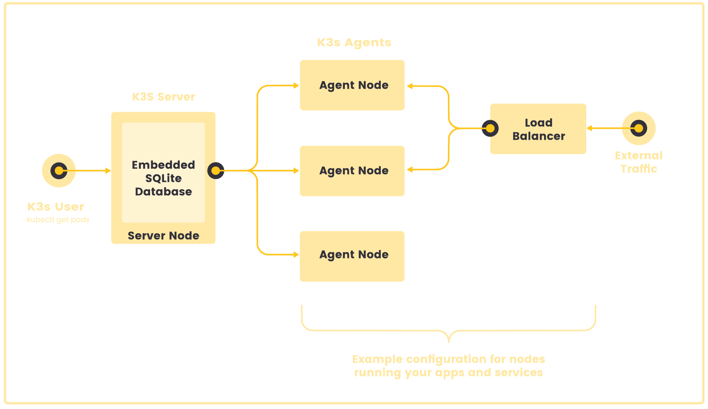
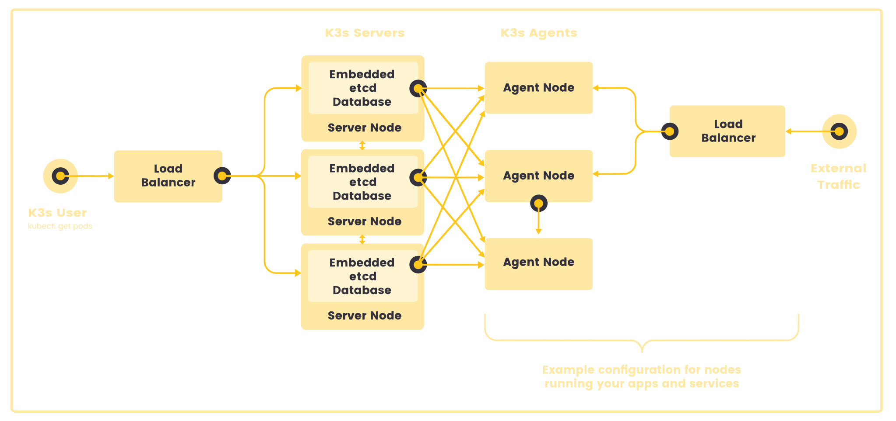
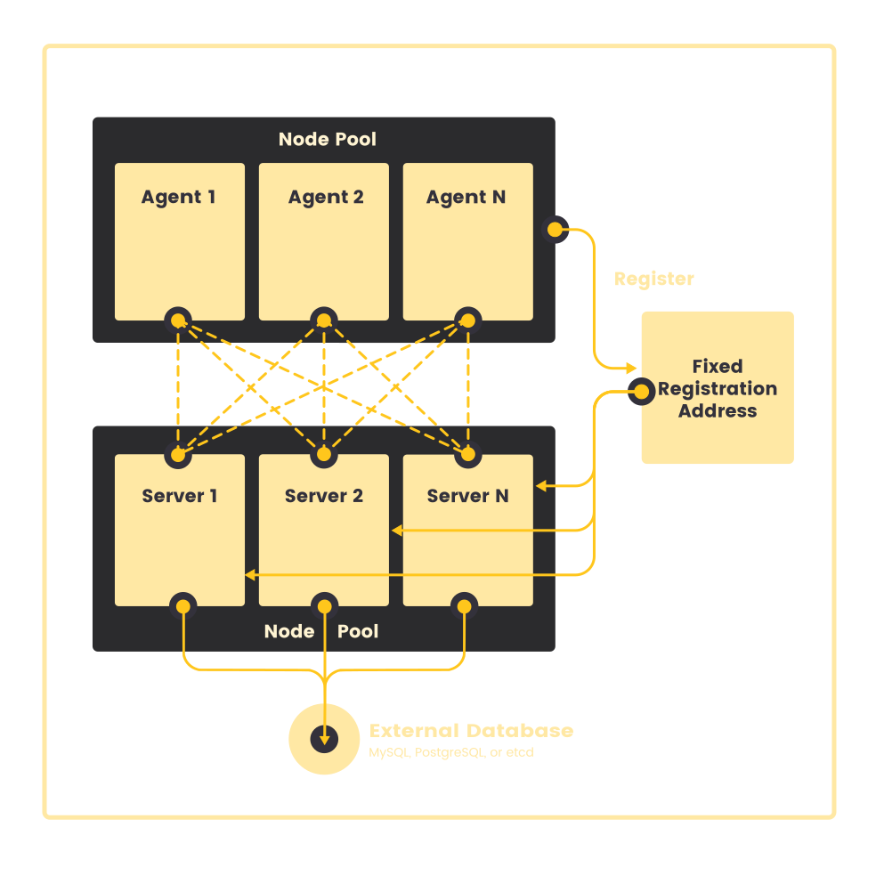

# KUBERNETES
Orchestratore di container, design: accoppiamento debole tra container, indipendente dall'infrastruttura.
> Può fare:
> - Storage discovery e load balancing
> - Autoscaling, rollback e rollout automatici
> - Orchestrazione
> Non può fare
> - Fornire architettura a livello applicazione
> - Deployare / Buildare un'applicazione
 

- Repository: https://github.com/kubernetes/kubernetes
- Componenti: https://kubernetes.io/docs/concepts/overview/components/

Struttura principale: [ Cluster [ Node [ Pod ] ] ]

# K3S (versione consigliata dal professore per IoT)
Versione leggera di kubernetes con poco overhead.
- Distribuzione compatta: fornita come un singolo file binario o un'immagine container minimale.
- Archiviazione integrata: utilizza SQLite3 come backend predefinito, con supporto per etcd3, MySQL e PostgreSQL.
- Facilità di gestione: include un launcher che semplifica la configurazione di TLS e opzioni.
- Sicurezza predefinita: impostazioni sicure per ambienti leggeri.
- Gestione semplificata: l'intero piano di controllo di Kubernetes è eseguito in un unico processo, automatizzando operazioni complesse.
- Minime dipendenze esterne: richiede solo un kernel moderno e i cgroup montati.
- Componenti inclusi per una configurazione pronta all'uso:
	- containerd / cri-dockerd (runtime container)
    - Flannel (rete CNI)
    - CoreDNS (DNS del cluster)
    - Traefik (Ingress Controller)
    - ServiceLB (bilanciamento del carico)
    - Kube-router (policy di rete)
    - Local-path-provisioner (gestione storage locale)
    - Spegel (mirror distribuito per immagini container)
    - Strumenti di sistema (iptables, socat, ecc.)

# Architettura di K3S:
## Server e agent
- ``` k3s server```: equivalente al Control Plane di Kubernetes, è il nodo che gestisce il cluster. Di solito assegna i pod ai nodi

  - API Server → riceve le richieste da kubectl e dal controller.

  - Controller Manager → mantiene lo stato desiderato del cluster.

  - Scheduler → assegna i Pod ai nodi disponibili.

  - Embedded SQLite (o altro DB) → K3s usa SQLite invece di etcd per la persistenza dei dati, riducendo il consumo di risorse.

- ``` k3s agent```: è un host che esegue senza controlpane e datastore, si connette al server per ricevere istruzioni.

In entrambi:
- c'è un kublet che comunica con i il containerd
- containerd utilizzato al _posto di docker_ per gestire dei Pod[1 ... N]
 


**fasi di registrazione dei nodi agent**:
1. **Connessione al server node:**
	
	L'agente si connette al supervisore (e al kube-apiserver) attraverso un bilanciatore locale sulla porta 6443.
	Il bilanciatore mantiene una lista di endpoint disponibili, inizialmente contenente solo l'indirizzo specificato con --server.
2. **Recupero degli endpoint del cluster**:

    Dopo la connessione iniziale, l'agente ottiene l'elenco degli indirizzi dei kube-apiserver dal servizio Kubernetes nel namespace predefinito.

    Questi endpoint vengono aggiunti al bilanciatore, le connessioni sono tolleranti a guasti di singoli server.

3. **Autenticazione del nodo:**

    L'agente si registra al server usando un segreto del cluster e una password generata casualmente, salvata in ```/etc/rancher/node/password```.

    Il server memorizza queste password come segreti Kubernetes nel namespace kube-system, con il formato ```<hostname>.node-password.k3s```.

4. **Rimozione e riaggiunta di un nodo:**

    Se la directory ```/etc/rancher/node``` viene eliminata o se un nodo deve essere reintegrato con lo stesso nome, prima deve essere rimosso dal cluster.

    La rimozione pulisce l'entry del nodo e il relativo segreto, permettendo la sua nuova registrazione.

5. **Riutilizzo di nomi host:**

    Se si riutilizzano frequentemente gli stessi nomi host ma non è possibile eliminare i segreti delle password dei nodi, si può usare il flag ```--with-node-id```.

    Questo flag aggiunge automaticamente un ID univoco al nome host, memorizzandolo in ```/etc/rancher/node/```.

## Sestup single-server con DB

Ogni agent node è registrato sullo stesso server node. Un utente puà effettuare chiamate
API sul server node per gestire le risorse



## High-Availability K3s

Architettura simile, ma tra l'user e il server c'è un **Load Balancer**.
- I server node ( 3 o più) servono le API kubernetes ed eseguono altri servizi come il control-plane.
- Un datastore interno come etcd o esterno comes postgre, SQLite è usato per la persistenza dei dati.


## Fixed Registration Adress per agent nodes

Dopo la registrazione con il nodo agent, stabilisce una connessione direttamente con uno dei server node.



# Installazione locale e su più nodi di k3s
## Requisiti
- Server: 2 core CPU, 2 GB RAM (con 4GB di ram supporta fino a 350 agent, nodi server (HA) aumentano la capacità del 50%)
- Agent: 1 core CPU, 512 MB RAM
- Disco: Preferibile SSD per prestazioni ottimali (evitare SD card o eMMC su Raspberry Pi)

Architettura e OS Supportati
 -Supporta x86_64, ARMHF, ARM64/AARCH64
- Funziona su Linux, con alcuni setup aggiuntivi per SUSE, RHEL, Fedora, Ubuntu, Debian e Raspberry Pi OS

**Configurazione**
- Hostname univoco per ogni nodo (usare ```--with-node-id``` se riutilizzati)
- Cgroups attivi su Raspberry Pi (aggiungere ```cgroup_memory=1 cgroup_enable=memory``` a ```/boot/cmdline.txt```)
- Su Ubuntu (21.10-23.10), installare ```linux-modules-extra-raspi``` per supporto VXLAN

**Networking**

- Porta ```6443```: accessibile da tutti i nodi per API Kubernetes
- Porta ```8472``` (UDP): richiesta per Flannel VXLAN
- Porta ```10250``` (TCP): necessaria per il metrics server
- Porta ```2379-2380``` (TCP): richiesta solo per HA con embedded etcd
- Proteggere la porta ```VXLAN``` (8472) con un firewall per evitare attacchi alla rete del cluster

> Nota: Per cluster grandi, aumentare la subnet del Cluster CIDR (```--cluster-cidr```) per non esaurire IP.


## API
**Cluster signolo nodo**
```sh

curl -sfL https://get.k3s.io | sh - # installa in locale
# INSTALL_K3S_EXEC="server --flannel-backend none" K3S_TOKEN=12345 sh -s - # con variabili d'ambiente

# Per creare un cluster multi-nodo, i nodi devono connettersi al master.

sudo cat /var/lib/rancher/k3s/server/node-token       # visualizza il token
curl -sfL https://get.k3s.io | K3S_URL="https://[MASTER_IP]:6443" K3S_TOKEN="<TOKEN>" sh -

kubectl get nodes                   # visualizza nodi attivi
```

Disposizione di server e agent: 
```sh
sudo k3s server
sudo k3s kubectl get nodes

# On a different node run the below. NODE_TOKEN comes from
sudo k3s agent --server https://myserver:6443 --token ${NODE_TOKEN}
## API k3s
L'API sever espone una REST API

Il "desired state" è espresso tramite un file YAML

Il CLI () di kubernetes è chiamato kubectl comunica con l'API server e le sue informazioni di connessione
sono nella cartella ```~/.kube/config``` 

Il "contesto" è un grupo di parametri di accesso a un cluster k3s. 
Contiene un cluster k3s, utente e un namespace.


```

## Fasi di Configurazione k3s

### 1. Deployment
Un Deployment è una risorsa che gestisce il lifecycle di uno o più Pod in Kubernetes. Permette di:
- Creare e aggiornare gruppi di Pod (gruppi di container che vengono eseguiti insieme).
- Gestire il numero di repliche (scalabilità).
- Assicurare che l’applicazione sia sempre disponibile.
- Fare rollback a una versione precedente se necessario.

Tutti i deployment sono visualizzabili con ```kubectl get deployments```, indicando anche i pod attivi

#### Esempio
```yaml
apiVersion: apps/v1
kind: Deployment
metadata:
  name: [nome-app]
  labels:
    app: [nome-app]
spec:
  replicas: [n-pods]  # 🔹 Numero di repliche dei Pod
  selector:
    matchLabels:
      app: [nome-app]  # 🔹 Kubernetes sa che questi Pod appartengono a questo Deployment
  template:
    metadata:
      labels:
        app: [nome-app]  # 🔹 Etichetta assegnata ai Pod per il Service
    spec:
      containers:
      - name: [nome-app]
        image: [nome-immagine]:[versione]  # 🔹 L'immagine da usare
        ports:
        - containerPort: [porta]  # 🔹 La porta che il container espone

```
- Se un Pod si arresta per errore, Kubernetes lo ricrea automaticamente.
- Il Deployment si assicura che ci siano sempre N Pod attivi.

> ***IMPORTANTE***
> Dato che k3s usa containerd invece di Docker, devi caricare l'immagine nel registry interno.

### 2. Service
#### Tipi di Servizi in Kubernetes

I services hanno due obiettivi principali: accoppiamento debole e separazione interno - esterno del cluster. Funziona come un “proxy” che smista il traffico verso i Pod giusti.

Nel cluster, ogni Pod ha un ip interno, ma ricordiamo che sono "effimeri", ossia possono cambiare ogni volta che il Pod viene riavviato. Il Service permette di avere una stabilità di Ip. 

Il service permette anche Load Balancing, ovvero di distribuire il carico tra più Pod.
In Kubernetes, un **Service** è quindi un'astrazione che espone un'applicazione in esecuzione su un insieme di **Pod**, fornendo un punto di accesso stabile.  

---

1. **ClusterIP (Default)**
- **Cos'è?**  
Rende il servizio accessibile **solo all'interno del cluster**, assegnando un IP virtuale interno.  

- **Quando usarlo?**  
Quando un'app deve essere accessibile solo da altri pod nel cluster (es. microservizi interni).
> Es. Abbiamo tre nodi, ognuno ha un pod che esegue un'applicazione in un container, uno per il frontend e uno per il backend. Se devono
> comunicare tra loro, usano il ClusterIP.

```yaml
apiVersion: v1
kind: Service
metadata:
  name: my-service
spec:
  selector:
    app: my-app # nel deployment, è il "selector" che identifica i pod. 
                # Serve al service per capire dove indirizzare il traffico
  ports:
    - protocol: TCP
      port: 80         # porta esposta dal service, su cui “ascolta”
      targetPort: 8080 # porta esposta dal container all’interno del Pod 
```

L'Ingress sarà configurato così:

```yaml
apiVersion: networking.k8s.io/v1
kind: Ingress
metadata:
  name: my-app-ingress  
spec:
  rules: ... 
    servicePort: 80
```

[!image](../../assets/Screenshot%20from%202025-04-14%2019-51-42.png)

[!image](../../assets/Screenshot%20from%202025-04-14%2019-56-04.png)

2. **NodePort**
- **Cos'è?**  
Espone il servizio su una porta fissa di ogni nodo, rendendolo accessibile dall'esterno tramite [NodeIP]:[NodePort]. 

- **Quando usarlo?**  
Testare un accesso esterno senza un bilanciatore di carico, per piccoli cluste.

```yaml
apiVersion: v1
kind: Service
metadata:
  name: my-service
spec:
  type: NodePort
  selector:
    app: my-app
  ports:
    - protocol: TCP
      port: 80  # porta del Service (es. 80), utile se vuoi farlo usare da altri Pod
      targetPort: 8080 # porta del container
      nodePort: 30007  # Esposta all'esterno su ogni nodo del cluster. Deve essere tra 30000 e 32767
```
#### Esempio con NodePort
Rendo il servizio disponibile nella mia sottorete
```yaml
apiVersion: v1
kind: Service
metadata:
  name: [nome-servizio]
spec:
  selector:
    app: [nome-servizio]
  ports:
    - protocol: TCP
      port: [port]
      targetPort: [port]
      nodePort: 30007  # 🔹 Kubernetes assegna una porta tra 30000-32767
  type: NodePort

```

3. **LoadBalancer**
- **Cos'è?**  
Crea un IP pubblico e un bilanciatore di carico esterno per instradare il traffico ai pod interni. (Richiede un provider cloud o MetalLB per ambienti on-prem).

- **Quando usarlo?**  
Se vuoi esporre un servizio su internet con un IP pubblico e bilanciamento del carico.

```yaml
apiVersion: v1
kind: Service
metadata:
  name: my-service
spec:
  type: LoadBalancer
  selector:
    app: my-app
  ports:
    - protocol: TCP
      port: 80 # porta pubblica
      targetPort: 8080 # porta container

```

4. **ExternalName - 5. HeadlessService**
Il 4. reindirizza il traffico a un nome di dominio esterno, il 5. Non assegna un IP al servizio, ma restituisce direttamente gli indirizzi IP dei pod.

- Per poter esporre un pod all'esterno devo creare un service. I Pod, infatti, hanno un IP volatile, quindi se uno viene riavviato cambia IP e l’applicazione potrebbe non trovarlo più.

Per visualizzare il servizio tra altre macchine, eseguo ```ip a``` e noto che il mio Ip Pubblico è ```inet 192.168.178.42/24 brd 192.168.178.255 scope global dynamic noprefixroute wlo1```.
Perciò alla porta 30080 di quell'indirizzo trovo la pagina che ho hostato. Vale però solo per la mia **Sottorete**.

### 3. Ingress
Se hai più servizi e vuoi gestirli con un unico punto di accesso, usi un Ingress. Serve un Ingress Controller gestire il routing del traffico HTTP/HTTPS in modo più sofisticato.
Nel caso di un Ingress, generalmente il Service sarà di tipo ClusterIP (accessibile solo dentro il cluster) e si occupa di indirizzare il traffico ai pod corretti in base al nome e alla porta.
- Definzione regole che stabiliscono quali percorsi (URL) devono essere indirizzati a quale Service.
- Indirizzamento tramite hostname, ovvero la possibilità di definire il dominio (ad esempio, myapp.local) e quali percorsi (es. /api, /docs) devono essere inviati a ciascun servizio.
- Configurazione dell'Ingress Controller

```yaml
apiVersion: networking.k8s.io/v1
kind: Ingress
metadata:
  name: my-app-ingress
spec:
  rules:
  - host: myapp.local  # dominio per accedere all'app, verrà reindirizzato a
    http:
      paths:
      - path: /        # Il traffico che arriva su root viene inviato al service
        pathType: Prefix
        backend:
          service:
            name: my-app-service  # Il nome del service che riceve il traffico
            port:
              number: 80  # La porta esposta dal service
```
Va poi verificata la configurazione del DNS per accedere tramite il dominio desiderato.
Per accedere all' Ingress con un dominio personalizzato va Modificato il file /etc/hosts (per un ambiente di test locale) o configurare un record DNS per indirizzare il dominio (es. myapp.local) all'IP dell'Ingress Controller.

Esempio di configurazione /etc/hosts: ```127.0.0.1 myapp.local```

## Test con k3s
### 1. App default nginx: LoadBalancer ( /nginx-app-kubernetes)
Creiamo ora una prima applicazione (file nella directory nginx-app-kubernetes)

- Creo un file ```nginx-deploy.yaml```, poi lo applico
```sh
kubectl apply -f nginx-deploy.yaml
kubectl get pods    # Ottengo i due pod attivi che avevo configurato nel file yaml
```
- Creo un file ```nginx-service.yaml```, poi lo applico

```sh
kubectl apply -f nginx-service.yaml
kubectl get service    # Ottengo i servizi per i pod attivi con anche un ip e porta associati
```

- Possiamo conoscere l'IP del servizio creato di nome **nginx-service** con
```sh
kubectl get svc nginx-service
```
L'output è:
```console
NAME            TYPE           CLUSTER-IP      EXTERNAL-IP   PORT(S)        AGE
nginx-service   LoadBalancer   10.43.177.157   <pending>     80:31066/TCP   2m39s
```

L'IP è in pending perchè Con k3s, il tipo LoadBalancer di default non assegna un IP pubblico automaticamente.
Soluzioni: 
1. Utilizzare Klipper Load Balancer (integrato in k3s) oppure configurare un service di tipo NodePort.
2. Utilizza l'Ingress Controller utilizzando Traefik (incluso in k3s)

Ho scelto l'opzione 2:

- Creo un file ```nginx-ingress.yaml```, poi lo applico
```sh
kubectl apply -f nginx-service.yaml
kubectl get nodes -o wide    # Ottengo i nodi attivi
```
- Aggiungo nel file /etc/hosts ``` 192.168.178.42  nginx.local``` -> sarebbe l'Ip del nodo (master), simulo un DNS

- Mi rendo conto che ora effettivamente il LoadBalancer sta distribuendo il carico sui vari pod. Eseguendo 
```sh
sudo kubectl describe service nginx-service

Name:                     nginx-service
Namespace:                default
Labels:                   <none>
Annotations:              <none>
Selector:                 app=nginx
Type:                     LoadBalancer
IP Family Policy:         SingleStack
IP Families:              IPv4
IP:                       10.43.177.157                                 # Ip del servizio interno nel cluser
IPs:                      10.43.177.157
Port:                     <unset>  80/TCP
TargetPort:               80/TCP
NodePort:                 <unset>  30080/TCP
Endpoints:                10.42.0.185:80,10.42.0.183:80,10.42.0.179:80  # Gli Ip dei pod
Session Affinity:         None
External Traffic Policy:  Cluster
Internal Traffic Policy:  Cluster
Events:
  Type    Reason                Age   From                   Message
  ----    ------                ----  ----                   -------
  Normal  Type                  35m   service-controller     NodePort -> LoadBalancer
  Normal  EnsuringLoadBalancer  35m   service-controller     Ensuring load balancer
  Normal  AppliedDaemonSet      35m   service-lb-controller  Applied LoadBalancer DaemonSet kube-system/svclb-nginx-service-7dfbfda6
```

### 2. App custom in node.js: NodePort ( /node-app-kubernetes )
Da implementare...

# Riassunto comandi utili

- ```kubectl apply -f <risorsa>```: applica la configurazione YAML
- ```kubectl get nodes```: mostra lo stato dei nodi del cluster.
- ```kubectl get pods```: mostri lo stato dei pod
- ```kubectl get deployments```: mostra i dettagli del deployment
- ```kubectl get services```: mostri lo stato del servizio

# Documentazione consultata
- [Corso di rancher academy](https://www.rancher.academy/courses/take/k3s-basics/lessons/47407227-introduction-lesson)
- https://www.youtube.com/watch?v=1hwGdey7iUU
- https://www.youtube.com/watch?v=T4Z7visMM4E